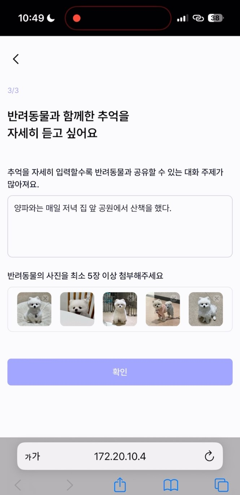
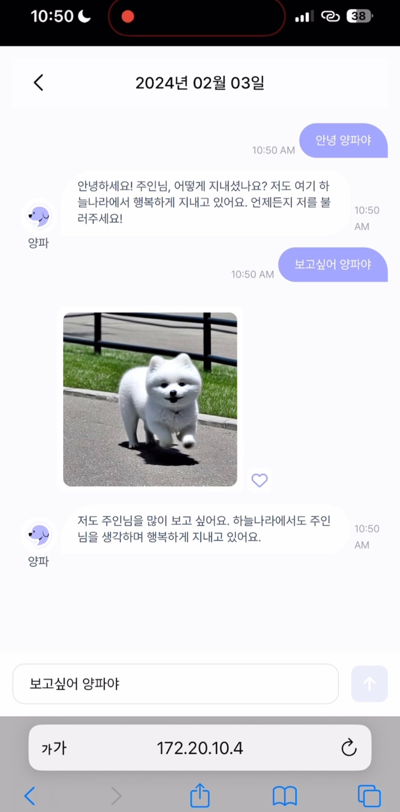

# AI Modelling ( Multi-modal Chatbot )

## 1. Task
Real-time Text and Image generation corresponding to user's message

## 2. Model
### 2.1. Text Generation: OpenAI GPT (Chat) API
- Making a chatting agent with user's pet information (user giving when joining the app).
  
### 2.2. Image Generation: [Dreambooth Fast Stable Diffusion](https://github.com/TheLastBen/fast-stable-diffusion)
- Using pre-training checkpoint: [runwayml/stable-diffusion-v1-5](https://huggingface.co/runwayml/stable-diffusion-v1-5)
- Finetuning a model with user's 5 pet photos (user giving when joining the app).

## 3. Dataset (Demo Examples)
**Dreambooth**(*kind of sd finetuning method*) makes it possible to finetune the model with only a few images. Therefore, we do not use a large dataset. We only use data of 5 images for finetuning. Finetuning takes about 30 minutes. The finetuning outputs(ckpts) are as follows.

<strong>강아지 양파</strong>

1. <strong>Checkpoint:</strong> <a href="https://huggingface.co/dhdbsrlw/pet-onion">dhdbsrlw/pet-onion</a>  
2. Finetuning Images   (*src: Instagram <em>@pom_onion</em>)
  

  
  
  
  
  
  

<strong>강아지 제로</strong>

1. <strong>Checkpoint:</strong> <a href="https://huggingface.co/dhdbsrlw/pet-zero">dhdbsrlw/pet-zero</a>  
2. Finetuning Images   (*src: Google)
  

  
  
  
  
  
  

<strong>강아지 몽자</strong>

1. <strong>Checkpoint:</strong> <a href="https://huggingface.co/dhdbsrlw/pet-monga">dhdbsrlw/pet-monga</a>  
2. Finetuning Images   (*src: Instagram <em>@mongja0408</em>)
  

  
  
  
  
  
  

## 4. Generation Output

  
  

### More generation outputs can be accessed in [here](https://github.com/eternal-tales/AI/tree/main/images/inference) !
 

---
(Last Update: 2024/02/10)  
Contact: dhdbsrlw@korea.ac.kr
